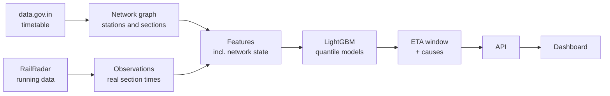

# SANKET — Network-Aware Dynamic ETA for Coaching Trains

**Smart India Hackathon 2026 · Problem Statement 26028 · Ministry of Railways · Team Claymore**

SANKET predicts when a train will reach each station ahead of it. Instead of
a single time, it returns a **window** (for example 15:10–15:40) and **names
the causes** of the expected delay. Its central idea: on Indian Railways,
trains are mostly late because of *other trains*, so the model looks at the
traffic around each train — who is ahead, how close, how late — rather than
treating every train in isolation.

> **Status (22 September 2026):** data pipeline and feature engineering are
> working on real data. Model training, evaluation, API and dashboard are in
> progress. See [Project status](#project-status).

---

## The problem

Today, a coaching train's ETA is essentially arithmetic:

```
ETA at station S  =  scheduled arrival  +  current delay  −  recovery time
```

Every term is either fixed in the timetable or measured in the past. Nothing
in the formula looks at the track ahead — speed restrictions, congestion, or
how late the preceding train is running. So the estimate stays confident and
keeps slipping.

## Our approach

**1. Predict track, not trains.** A journey is split into sections between
consecutive halts. For each section we predict the minutes lost against the
booked running time, then chain the sections forward to get an ETA at every
station on the route.

**2. Look at the network.** Each prediction sees the traffic around the
train: the train that left the same station just before it, the gap to that
train, how late it was running, and how many trains the timetable schedules
through that station around the same time.

**3. Return a range, not a number.** Quantile models give a low, middle and
high estimate, so the output is a window with a confidence level.

**4. Explain every minute.** Predictions are broken down into named causes,
so a controller sees *why* a train will be late, not just *that* it will be.



---

## Project status

| Component | Location | Status |
|---|---|---|
| Network graph from the timetable | `src/graph/` |  working, 28 tests |
| RailRadar collector (quota-safe, run-day aware) | `src/collect/` |  running nightly |
| Parser with data-quality rules | `src/collect/parse.py` |  working, 27 tests |
| Network features (train ahead, headway, precedence) | `src/features/build_features.py` |  working, 23 tests |
| Scheduled-traffic feature | `src/features/schedule.py` |  in progress |
| Model training | `src/model/` |  in progress |
| Evaluation and ablation | `src/eval/` | in progress |
| API | `src/api/` |  in progress |
| Dashboard | `frontend/` |  in progress |

---

## Data

We use two sources. Neither could do the job alone.

| | data.gov.in timetable | RailRadar API |
|---|---|---|
| What it is | The published schedule for all trains | Recent actual running data |
| What it gives us | The network: stations, sections, booked times, which trains share track | What really happened: actual departure and arrival times, delays |
| Used for | Graph, corridor selection, station positions, scheduled traffic | Training labels and live-state features |
| Limitation | Static snapshot from around 2017 | 1,000 requests/month; only trains it tracks |

### Key numbers

**From the timetable (whole network):**
11,112 trains · 186,113 stops · 28,130 unique directed sections.
The busiest sections — BNXR→DDJ in Kolkata and MLND→TNA in Mumbai — each
carry **199 trains**. That shared track is why delay propagates.

**From RailRadar (Delhi–Mumbai corridor, 17–20 September 2026):**
38 tracked trains · 1,545 real section observations · minutes lost per
section ranges from −65 (time recovered) to +159, median −1.

### Data quality

Most of the raw data is not what it appears to be. Four traps, each found by
checking rather than assuming:

| Trap | What we saw | Fix |
|---|---|---|
| **Passing points** | ~300 stations per route, 98% showing zero minutes lost. At stations a train doesn't stop at, "actual" times are interpolated, not observed. | Use halts only |
| **Untracked runs** | Halts marked as departed with actual times but no delay values — the schedule copied across. One train "matched its timetable to the minute" for 1,000 km. | A halt counts only if it carries delay data |
| **Projected tails** | For trains still running, halts not yet reached carry *forecast* times. Training on these would teach the model to copy RailRadar's own predictions. | A halt counts only if its status is `departed` or `at-station` |
| **Not running that day** | Weekly trains looked "untracked" when fetched on days they don't run. | Fetch each train only on its run days |

Together these reduced 20,789 raw rows to 1,545 genuine observations. Every
remaining row is a train that actually left one station and actually arrived
at the next.

---

## Repository layout

```
Sanket/
├── src/
│   ├── graph/          timetable → stations, sections, booked running times
│   ├── collect/        RailRadar client, nightly collector, quota ledger, parser
│   ├── features/       feature engineering incl. network and schedule features
│   ├── model/          LightGBM quantile models
│   ├── eval/           train/test splits, baselines, metrics, charts
│   └── api/            FastAPI service
├── frontend/           React dashboard
├── notebooks/          scripts to build data and run diagnostics
├── tests/              pytest suites
├── data/
│   ├── raw/            timetable CSV, RailRadar JSON (not committed)
│   └── processed/      observations, corridor lists
├── docs/               glossary, data sources, figures
└── NOTES.md            decisions log
```

---

## Getting started

Developed on Windows with PowerShell and Python 3.14.

```powershell
git clone https://github.com/divyanshroutray8d13-wq/Sanket.git
cd Sanket
python -m venv .venv
.\.venv\Scripts\Activate.ps1
pip install -r requirements.txt
pytest -v
```

### Data you need to add yourself

**Timetable:** download the Indian Railways train time table dataset from
[data.gov.in](https://data.gov.in) and save it as `data/raw/trains.csv`.
**Do not open it in Excel** — saving it from Excel silently converts it to a
different format and breaks the pipeline.

**RailRadar key:** create a free key at [railradar.in](https://railradar.in)
and put it in a `.env` file in the repo root:

```
RAILRADAR_API_KEY=your_key_here
```

`.env` is git-ignored. Never commit it or paste the key anywhere.

### Running the pipeline

All commands run from the repo root.

```powershell
# 1. Build the network graph from the timetable
python -m notebooks.run_src_build_graph

# 2. Collect running data for a date (defaults to yesterday)
#    Run in the evening, after trains that left yesterday have arrived.
python -m src.collect.run_collector 2026-09-20

# 3. Turn raw RailRadar files into the observations table
python -m notebooks.build_observations

# 4. Check what the features look like on real data
python -m notebooks.check_features
```

The collector respects RailRadar's free tier: 7 seconds between requests,
a quota ledger in `data/raw/railradar/_quota.json` with a hard ceiling, and a
run-day cache so weekly trains are only fetched on days they run. Already
downloaded files are never fetched twice.

---

## Tests

```powershell
pytest -v
```

The tests are the specification. Several exist specifically to catch
**data leakage** — the model seeing information it would not have at
prediction time. For example, a train that leaves a station *after* the one
being predicted must never be counted as "the train ahead", and neither must
one leaving at the same minute.

---

## Limitations

We would rather state these plainly than have them discovered:

- **Freight is invisible.** Freight trains share the track and cause real
  delays, but appear in neither data source.
- **We see a sample of the traffic.** RailRadar only returns trains we ask
  about and that it tracks, so the "train ahead" we find is often not the
  one actually ahead. The scheduled-traffic feature is our response to this.
- **The timetable is from around 2017.** Some trains have been renumbered or
  withdrawn since, and newer services are missing.
- **The live Railways systems are internal.** RTIS and COA, which hold the
  real operational record, are not publicly accessible. Our ingestion is
  designed around the data they would provide.
- **Short history.** Our running data covers days, not months, so seasonal
  effects such as monsoon and fog are not yet represented.

---

## References

- Sarhani, M. & Voß, S. (2024). Prediction of rail transit delays with
  machine learning: How to exploit open data sources. *Multimodal
  Transportation*, 3, 100120.
- Huang, P. et al. (2020). Modeling train operation as sequences: A study of
  delay prediction with operation and weather data. *Transportation Research
  Part E*, 141, 102022.
- Li, Z. et al. (2020). Near-term train delay prediction in the Dutch
  railways network. *International Journal of Rail Transportation*, 9(6),
  520–539.
- Shi, R. et al. (2021). Prediction and analysis of train arrival delay based
  on XGBoost and Bayesian optimization. *Applied Soft Computing*, 109, 107538.
- Park, Y. et al. (2020). Assessing public transit performance using
  real-time data: spatiotemporal patterns of bus operation delays.
  *International Journal of Geographical Information Science*, 34(2),
  367–392.

**Data:** Indian Railways time table, [data.gov.in](https://data.gov.in) ·
Running data, [RailRadar](https://railradar.in)
