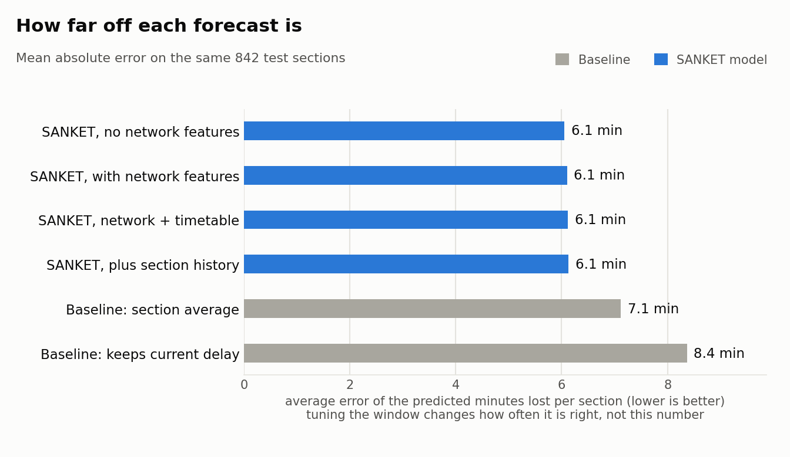
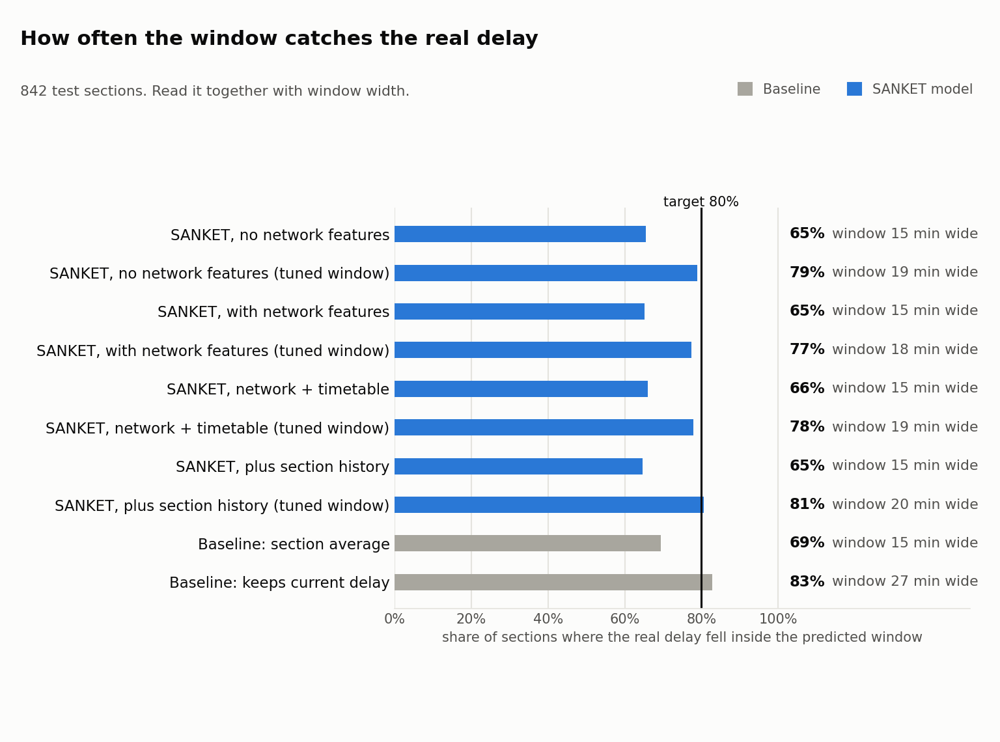

# SANKET results

<!--
FILLING THIS IN (delete this whole comment block before submission)

1. Run on the REAL predictions (never the fake folder):
     git pull
     python -m src.eval.metrics
     python -m src.eval.plots
     python -m src.eval.compare
2. Replace every ___ with the number from those outputs.
3. In "What it means", keep ONE of the two versions (A or B) and delete the other.
4. Round minutes to one decimal, percentages to whole numbers.
5. Check the two charts in docs/figures/ show no "FAKE DATA" stamp.
6. Every number in this file must be traceable to one of the three commands above.
-->

**Question:** does knowing what other trains are doing make SANKET's arrival forecasts better?

**Short answer:** ___ (one sentence, written last, after the sections below are filled in)

---

## What we compared

Four ways of predicting how many minutes a train will lose, or gain, on each stretch of track between two stations. Negative minutes mean the train made up time.

| Experiment | What it does |
|---|---|
| **Baseline: keeps current delay** (`baseline_zero`) | Assumes the train loses no further time. This is roughly what train apps show today: current delay carried forward. |
| **Baseline: section average** (`baseline_section`) | Predicts the average time lost on that stretch in past data. A simple rule, no model. |
| **SANKET, no network features** (`model_base`) | Our model, using only facts about the train itself and the stretch of track. |
| **SANKET, with network features** (`model_network`) | The same model, plus what other trains are doing: who is ahead on the same track, how close, and how late. |

The last two differ in one thing only: the network features. That makes the comparison between them the direct test of SANKET's main idea.

## How we tested it

- **Data:** real running records from RailRadar for trains on the Delhi to Mumbai corridor, collected nightly from ___ to ___. In total ___ sections from ___ train runs.
- **Split by time:** every experiment learned from earlier days and was tested on the latest day, ___. Nothing from the test day was used in training, so the model is scored on days it has never seen, as it would be in real use.
- **Same test for everyone:** all four experiments were scored on exactly the same ___ test sections. The scoring code refuses to compare experiments tested on different rows.

## How we scored it

| Measure | Plain meaning | Better is |
|---|---|---|
| **Average error (MAE)** | How far off the most likely prediction is, in minutes, on average | Lower |
| **Coverage** | How often the real minutes fell inside the predicted window | Close to 80% |
| **Window width** | How wide the predicted window is, in minutes | Narrower, at the same coverage |
| **Bias** | Whether predictions lean too late (positive) or too early (negative) | Close to 0 |

Coverage and width are always read together. A window of "somewhere between 0 and 3 hours" would almost always be right and would be useless.

## Results

| Experiment | Average error (min) | Coverage | Window width (min) | Bias (min) |
|---|---|---|---|---|
| Baseline: keeps current delay | ___ | ___% | ___ | ___ |
| Baseline: section average | ___ | ___% | ___ | ___ |
| SANKET, no network features | ___ | ___% | ___ | ___ |
| SANKET, with network features | ___ | ___% | ___ | ___ |

All rows are scored on the same ___ test sections from ___ train runs.





## Is the difference real, or luck?

The test day has ___ sections, but they come from only ___ train runs. Sections of one train share its delays: one late train makes all of its sections late together. So the real amount of independent evidence is closer to the number of train runs than to the number of sections.

To avoid overclaiming, we resampled whole train runs 5,000 times and recomputed the gap each time. The range below covers 95% of those resamples. If it crosses zero, we cannot say which experiment is better.

| Question | Gap in average error | 95% range | Verdict |
|---|---|---|---|
| Do network features help? (with vs without) | ___ min | ___ to ___ | ___ |
| Does SANKET beat the best baseline? | ___ min | ___ to ___ | ___ |
| Does SANKET without network features beat it? | ___ min | ___ to ___ | ___ |

A positive gap means the first experiment had the smaller error.

## What it means

<!-- Keep ONE version. Delete the other. -->

**Version A: network features helped.**
Adding what other trains are doing cut SANKET's average error by ___ minutes per section, from ___ to ___, and the gap held in ___% of resamples. Compared with carrying today's delay forward, SANKET is ___ minutes closer on average. This supports SANKET's main idea: much of a train's delay comes from the trains around it, and a forecast that sees them does better than one that looks at each train alone.

**Version B: network features did not clearly help.**
With the data we have, adding what other trains are doing did not reliably improve SANKET's forecasts: the gap was ___ minutes, and its range crosses zero. We report this plainly. Likely reasons are a small test set (___ train runs), few collection nights, and little traffic overlap between the trains we tracked. SANKET without network features still ___ the best baseline by ___ minutes. The next step is more nights of data on busier shared track, which is exactly what the overlap corridor collection is for.

## Does it work on other routes?

<!-- Fill after the zone-holdout run on Saturday 26. Delete this section if it is cut. -->

We trained on ___ and tested on ___, a route the model had never seen. Average error was ___ minutes, compared with ___ on the original test. ___ (one sentence on whether it transfers).

## Limits

- **Small test set.** ___ train runs on one test day. The ranges above show how much that limits certainty.
- **Few days of data.** Collection ran for ___ nights, so the model has seen few kinds of days: no fog season, no festival rush, no major disruption.
- **One main corridor.** Results are for Delhi to Mumbai. Other routes may behave differently.
- **Observed data only.** RailRadar reports where trains were, not why. Causes such as speed restrictions or signal holds are inferred, not recorded.
- **Tracking gaps.** Some trains and some stations are not tracked by RailRadar, and specials were excluded for that reason.

## Reproduce these numbers

From the repo root, with the real prediction files in `data/processed/predictions/`:

```
python -m src.eval.metrics
python -m src.eval.plots
python -m src.eval.compare
```

Scoring code: `src/eval/metrics.py`, `src/eval/plots.py`, `src/eval/compare.py`. Test split and baselines: `src/eval/split.py`, `src/eval/baselines.py`.
