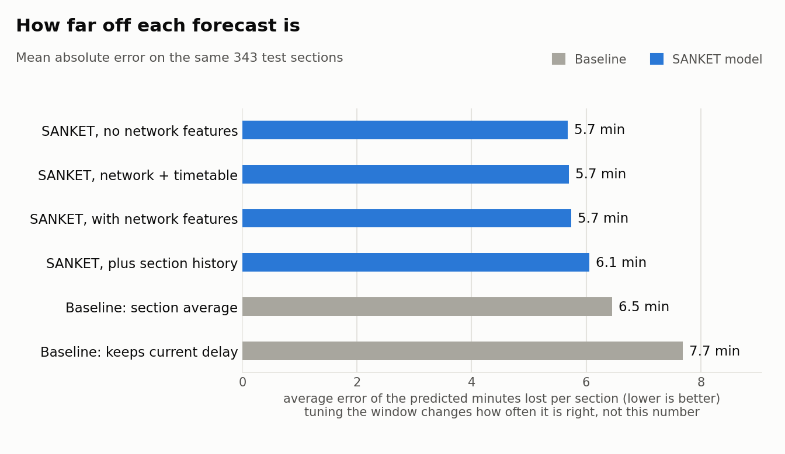
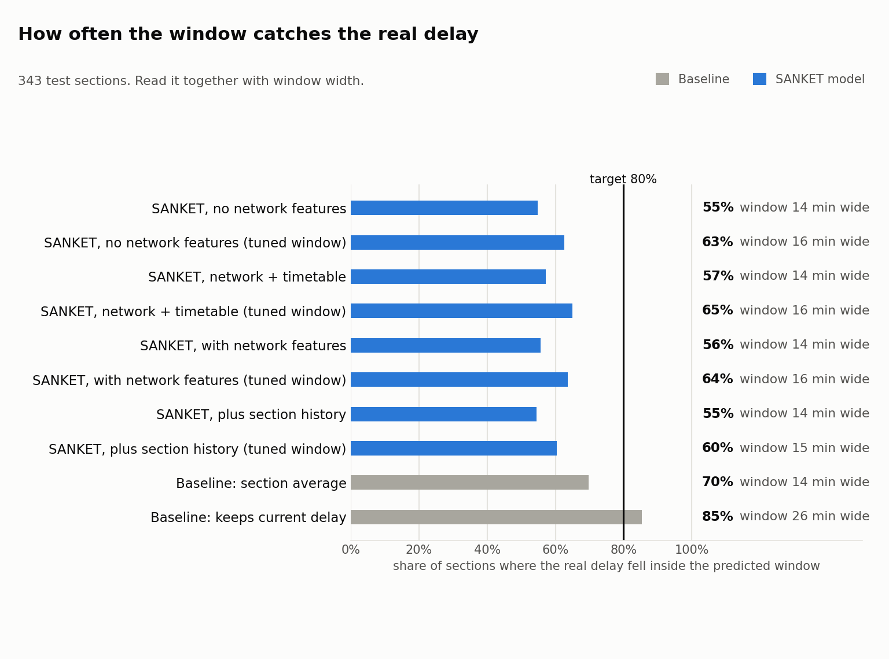

# SANKET results

**Question:** does knowing what other trains are doing make SANKET's arrival forecasts better?

**Short answer:** SANKET's model is clearly better than the way train apps predict delays today, by about 2 minutes per section against the naive baseline. With seven nights of data across three corridors, the network features are still not the reason why — and the section-history feature, which looked neutral in an earlier report, now looks like it actively hurts on a single section, even though a related signal helps a lot when forecasting several stations ahead (see "Does it work on other routes?" below).

---

## What we compared

Ways of predicting how many minutes a train will lose, or gain, on each stretch of track between two stations. Negative minutes mean the train made up time.

| Experiment | What it does |
|---|---|
| **Baseline: keeps current delay** (`baseline_zero`) | Assumes the train loses no further time. This is roughly what train apps show today: current delay carried forward. |
| **Baseline: section average** (`baseline_section`) | Predicts the average time lost on that stretch in past data. A simple rule, no model. |
| **SANKET, no network features** (`model_base`) | Our model, using only facts about the train itself and the stretch of track. |
| **SANKET, with network features** (`model_network`) | The same model, plus what other trains are doing: who is ahead on the same track, how close, and how late. |
| **SANKET, network + timetable** (`model_network_sched`) | Adds how many other trains are timetabled to leave that station within half an hour either side. |
| **SANKET, plus section history** (`model_base_hist`) | Adds how much time trains have lost on that stretch on earlier days. The train's own run is left out of its own history. |

Each experiment also has a **tuned window** version (`_cal`). Tuning does not change the prediction itself: it measures, on a day the model never learned from, how far outside the window the real value tended to fall, and widens the window by that much. So the tuned versions have the same average error and a more honest window.

`model_base` and `model_network` differ in one thing only: the network features. That makes the comparison between them the direct test of SANKET's main idea.

## How we tested it

- **Data:** real running records from RailRadar, collected nightly from 17 to 23 September 2026, now spanning three corridors (Delhi–Mumbai, Delhi–Howrah, and the Mumbai-overlap corridor). In total 343 test sections from 29 train runs — 16 of those runs on Delhi–Mumbai trains, 5 on Delhi–Howrah, and 8 on overlap-corridor trains.
- **Split by time:** every experiment learned from the six earlier days (17–22 September) and was tested on the latest day, 23 September. Nothing from the test day was used in training, so the model is scored on a day it has never seen, as it would be in real use. Window tuning used the last training day, 22 September, and never touched the test day.
- **Same test for everyone:** all experiments were scored on exactly the same 343 test sections. The scoring code refuses to compare experiments tested on different rows.

## How we scored it

| Measure | Plain meaning | Better is |
|---|---|---|
| **Average error (MAE)** | How far off the most likely prediction is, in minutes, on average | Lower |
| **Coverage** | How often the real minutes fell inside the predicted window | Close to 80% |
| **Window width** | How wide the predicted window is, in minutes | Narrower, at the same coverage |
| **Bias** | Whether predictions lean too late (positive) or too early (negative) | Close to 0 |

Coverage and width are always read together. A window of "somewhere between 0 and 3 hours" would almost always be right and would be useless.

## Results

| Experiment | Average error (min) | Coverage | Window width (min) | Bias (min) |
|---|---|---|---|---|
| Baseline: keeps current delay | 7.68 | 85% | 26.0 | +4.46 |
| Baseline: section average | 6.45 | 70% | 13.9 | +3.27 |
| SANKET, no network features | 5.67 | 55% | 14.1 | +2.36 |
| SANKET, no network features, tuned window | 5.67 | 63% | 16.0 | +2.36 |
| SANKET, with network features | 5.73 | 56% | 13.7 | +2.32 |
| SANKET, with network features, tuned window | 5.73 | 64% | 15.5 | +2.32 |
| SANKET, network + timetable, tuned window | 5.70 | 65% | 15.5 | +2.31 |
| SANKET, plus section history, tuned window | 6.05 | 60% | 15.0 | +2.65 |

All rows are scored on the same 343 test sections from 29 train runs.

Every SANKET model is closer than the better baseline. Before tuning, our windows were right only 55–57% of the time while claiming 80%; tuning helps but still leaves every tuned SANKET variant well under the 80% target, at 60–65%. **This has a known, fixable root cause, not just "needs more data" — see `docs/coverage_and_history_findings.md`.** In short: the calibration margin is fit on a single day and doesn't transfer reliably to a different test day; pooling more calibration days measurably fixes it (tested: 62.7% → 81.6% coverage), but it hasn't been adopted as the default yet pending a team decision on the width trade-off.





## Is the difference real, or luck?

The test day has 343 sections, but they come from only 29 train runs. Sections of one train share its delays: one late train makes all of its sections late together. So the real amount of independent evidence is closer to the number of train runs than to the number of sections.

To avoid overclaiming, we resampled whole train runs 5,000 times and recomputed the gap each time. The range below covers 95% of those resamples. If it crosses zero, we cannot say which experiment is better.

| Question | Gap in average error | 95% range | Verdict |
|---|---|---|---|
| Does SANKET beat the best baseline? (no network features) | +0.78 min | +0.14 to +1.51 | clearly better |
| Does SANKET beat the best baseline? (with network features) | +0.72 min | +0.09 to +1.41 | clearly better |
| Do network features help? (with vs without) | −0.06 min | −0.21 to +0.05 | not distinguishable |
| Does the timetable help on top of that? | +0.04 min | −0.10 to +0.20 | not distinguishable |
| Does the section's past help? | −0.38 min | −0.62 to −0.15 | **clearly worse** |

A positive gap means the first experiment had the smaller error.

## What it means

The learned model is worth it. Against the way apps predict delays today, carrying the current delay forward, SANKET (no network features) is 2.01 minutes closer per section; against the stronger section-average rule it is 0.78 minutes closer, and that gap held in 99% of resamples. Windows are still not honest at the 80% target, though — see the fix above.

With the data we have, adding what other trains are doing still did not reliably improve the forecasts: the gap was −0.06 minutes and its range crosses zero, same conclusion as an earlier report.

**Section history (`model_base_hist`) looks clearly worse here** (−0.38 min, better in 0% of resamples) **but the same underlying signal, aggregated across many sections instead of one, is central to the zone-holdout result below.** Traced in `docs/coverage_and_history_findings.md`: `sec_hist_mean` (one section's own noisy historical average) and `cum_hist_mean` (that same feature summed across every section to a distant station) are built from identical data, just aggregated at a different scale. Summing many noisy per-section estimates cancels noise and keeps the real "this stretch tends to run late" signal — plausibly why the same underlying feature can hurt individually but help in aggregate.

## Does it work on other routes?

Yes, on both corridors we tested it on. This is a genuine zone-holdout, different from the main results table above: the model saw **zero** rows, from **any** day, of the held-out corridor during training — not just a different test day, a corridor it has never encountered at all.

| Held out | Trained on | Test rows (train runs) | Model MAE | Naive MAE (predict no delay) | vs. the mixed-corridor test above |
|---|---|---|---|---|---|
| Delhi–Howrah | Mumbai + overlap | 231 (9 runs) | 7.88 min | 10.58 min | 2.21 min worse than the 5.67 min above |
| Mumbai overlap | Mumbai + Howrah | 1,088 (14 runs) | 5.36 min | 7.23 min | 0.31 min *better* than the 5.67 min above |

Both gaps against the naive baseline are real, not luck: resampling train runs 5,000 times, the model beat naive in 100% of resamples on both corridors (Howrah: +2.67 min, 95% range +1.86 to +3.18; overlap: +1.87 min, 95% range +1.48 to +2.27).

So it transfers, with a caveat. On the overlap corridor, a route the model never trained on did about as well as the routes it did train on — arguably the strongest single result in this document. On Howrah it transfers too, clearly better than guessing no delay, but at a real accuracy cost compared with a corridor the model has actually seen. Howrah's test set is also small (9 train runs), so treat that specific number as a first read, not a settled one.

This used `model_base` only (no network or history features), so it says the base model's core signal transfers across corridors — it doesn't test whether the network or history features specifically would transfer too.

## Limits

- **Small test set.** 29 train runs on one test day for the main table; 9–14 train runs for the zone-holdouts. The ranges above show how much that limits certainty.
- **More days of data than before, still not many.** Collection has run for 7 nights, so the model has seen few kinds of days: no fog season, no festival rush, no major disruption.
- **Three corridors, mostly mixed together.** The main results table draws on all three corridors mixed into one time-based split; the zone-holdout section above is the only genuine train/test split by corridor.
- **Observed data only.** RailRadar reports where trains were, not why. Causes such as speed restrictions or signal holds are inferred, not recorded.
- **Tracking gaps.** Some trains and some stations are not tracked by RailRadar, and specials were excluded for that reason.
- **Coverage below target, with a known fix pending adoption.** Tuned windows hold 60–65% of the time against an 80% target. A tested fix exists (pooling more calibration days) but changes window width and hasn't been adopted as default yet — see `docs/coverage_and_history_findings.md`.

## Reproduce these numbers

From the repo root, with the real prediction files in `data/processed/predictions/`:

```
python -m src.eval.metrics
python -m src.eval.plots
python -m src.eval.compare
python -m src.eval.export_results
```

The last command writes `frontend/public/results.json`, which the dashboard's Results page shows.

The zone-holdout numbers above use `src/eval/split.py`'s `corridor_holdout_split()` directly (not yet wired into a CLI script — ask if you want that added).

Scoring code: `src/eval/metrics.py`, `src/eval/plots.py`, `src/eval/compare.py`, `src/eval/export_results.py`. Test split and baselines: `src/eval/split.py`, `src/eval/baselines.py`. Model, window tuning and the experiment run: `src/model/train.py`, `src/model/calibrate.py`, `notebooks/run_experiments.py`.
